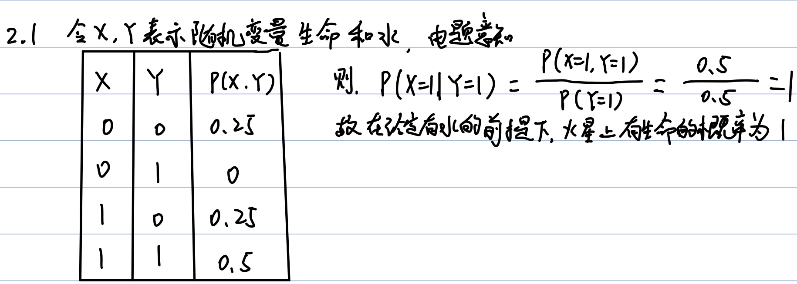

# 课后练习

### 1.1

+ Agent: 用传感器来感受环境并用执行器来与环境交互作用的事物
+ Agent函数：一种数学描述，将Agent的感知序列映射为动作
+ Agent程序：Agent函数在代码上的具体实现
+ 理性：每一步动作都选择让目标期望收益最大化的
+ 自主：有学习能力，能够通过学习改正或完善自身知识
+ 反射Agent:仅仅根据当前的感知来选择行动
+ 基于模型的Agent: 内部有模型会根据感知历史来维持内部状态，模型是关于世界如何运作的世界模型
+ 基于目标的Agent:能用目标信息来描述想要达到的状态

+ 基于效用的Agent：能使用更为细致通用的性能度量来对状态进行赋值，即效用函数
+ 学习Agent：由学习元件、评判元件、性能元件和问题产生器组成的Agent

### 1.2

```python
#-------基于目标的Agent--------

def goal_based_agent():
    state=UPDATE_STATE(state,action,percept,model)
    actions=GET_AVALIABLE_ACTION(state)    #获得当前状态下所有合法的行动
    next_states=UPDATE_STATE_IN_MODEL(state,actions,action_history)  #在model中采取行动得到下一个状态列表
    action=CHOOSE_ACTION_BASED_GOAL(actions,next_states,goal) #根据目标选择最优动作
    return action

#-------基于效用的Agent--------

def utility_based_agent():
    state=UPDATE_STATE(state,action,percept,model)
    actions=GET_AVALIABLE_ACTION(state)    #获得当前状态下所有合法的行动集合
    next_states=UPDATE_STATE_IN_MODEL(state,actions,action_history)  #在model中采取行动得到下一个状态集合
    action=CHOOSE_ACTIONS_BASED_GOAL(actions,next_states,goal) #根据目标选择最优动作集合
    best_action=CHOOSE_ACTION_BASED_UTILITY(action,state) #根据效用函数选择最优动作
    return best_action

```

### 2.1



### 2.2

