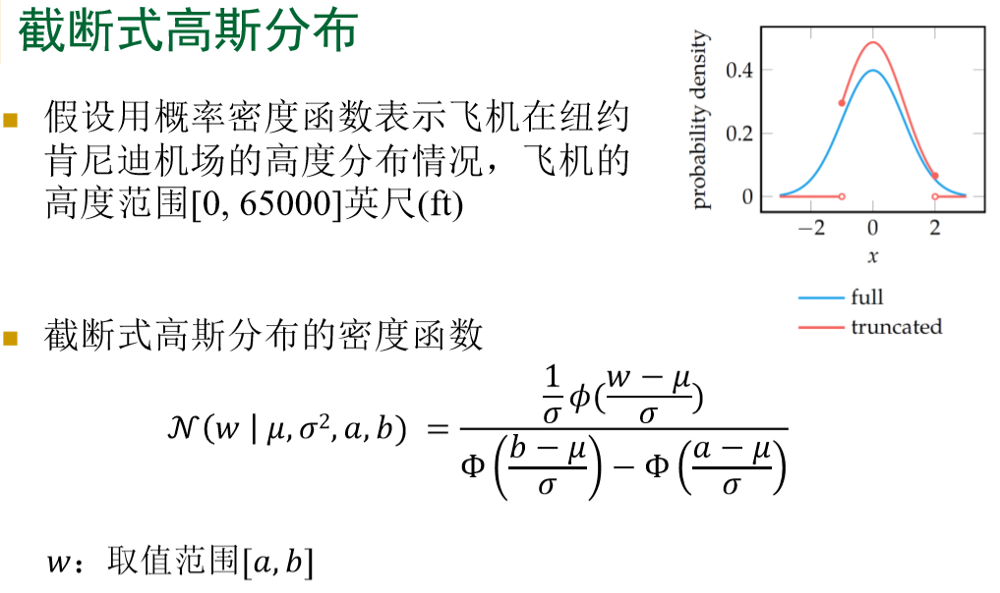

# Chapter1:智能系统概述

+ agent : 能够通过传感器（雷达、摄像头、激光、超声波等）感知其环境，并借助执行器作用于该环境的任何事物

+ 感知：任何给定时刻agent的感知输入

+ 感知序列：agent收到的所有输入数据的完整历史

+ Agent函数：抽象的数学描述，将感知序列映射为行动：    $a=\pi(h)$   (数学描述)

+ Agent程序：agent函数的具体实现，与Agent函数不同 

+ **理性Agent**：什么是理性的？

  >+ 定义成功的性能度量
  >+ Agent对环境的先验知识
  >+ Agent可以完成的行动
  >+ Agent截止到此时的感知序列
  >+ 定义理性Agent：对每一个可能的**感知序列**，根据已知的**感知序列** 提供的证据和Agent具有的**先验知识**，理性Agent应该选择能使其**性能度量最大化**的行动
  >+ 使**期望的性能**最大化，不同于全知Agent；选择动作只依赖于到此时的感知序列；能收集信息，从感知 的信息中学习；有自主性，通过学习弥补 不完整/不正确 的先验知识

+ **环境**

  >+ PEAS描述(任务环境的规范描述)：
  >  + 性能Performance
  >  + 环境Environment
  >  + 执行器Actuators
  >  + 传感器Sensors
  >
  >分类：
  >
  >+ **完全可观察的与部分可观察的**、完全不可观察的：Agent在每个时间点能否获取环境的完整状态
  >+ **单Agent与多Agent**：多Agent中通讯常作为理性行为，一些竞争环境中随机行为时理性的
  >+ **确定与随机**: 下一个状态是否完全取决于当前状态和Agent执行的动作
  >+ **片段式的与序贯式的**：
  >  + 下一个片段不依赖于以前片段中采取的行动(装配线上检验次品零件)
  >  + 当前决策会影响到所有未来的决策
  >+ **静态的与动态的**：动态环境在Agent计算的时候会发生变化；半动态：环境本身不随时间变化而变化，但是 Agent的性能评价随时间变化 
  >+ **连续的与离散的**： 

+ **Agent结构**

  >Agent=体系结构+程序
  >
  >+ 程序实现的是把感知信息映射到行动的函数
  >+ 体系结构是某个具备物理传感器和执行器的计算 装置，程序在该装置上运行
  >
  >**Agent程序**
  >
  >>+ 框架：输入为从传感器得到的当前感知信息，返 回的是执行器的行为抉择
  >>
  >>  **Agent程序以当前感知作为输入，Agent函数以感知历史作为输入**
  >>
  >>**四种基本的Agent程序**
  >>
  >>+ **简单反射Agent**: 基于当前的感知选择行动，不关注感知历史
  >>+ **基于模型的反射Agent**：用感知历史来维持内部状态,使用内部模型来跟踪环境
  >>+ **基于目标的Agent**：模型再加上目标，根据目标选择行动
  >>+ **基于效用的Agent**：效用函数驱动， 

+ **设计方法**

  >+ **显式编程**：显式地编码告诉Agent在各种可能经历的场景下该如何采取行动 ， 直接、无学习、基于规则、在简单问题上有效 
  >+ **优化**：给定策略空间和性能度量，在空间中搜索使得性 能度量最优的策略，即最优策略  ； 通过仿真实验评估策略的性能
  >+ **强化学习**：假设环境的模型未知，Agent与环境交互，从强化信号中学习 :dog:
  >
  
+ *课前练习*：

  >+ 一个Agent只能感知状态的部分信息，那么它不可能是理性的。  --false
  >+ 存在这样的任务环境，处于该环境中的纯反射Agent不可能有理性行为。 --true
  >+ 存在任务环境使得每个Agent都是理性的。 --true
  >+ Agent程序的输入与Agent函数的输入是相同的。 --false
  >+ 每个Agent函数都可以用程序/机器组合实现。 --false
  >+ 假设Agent从一组可能行动中随机选择行动。存在确定的任务环境使得此Agent是理性的。 --true
  >+ 一个给定的Agent在两个不同的任务环境中可能都是理性的。 --true
  >+ 在不可观察环境中每个Agent都是理性的。 --false
  >+ 一个理性的打牌Agent是不可能输的。 --false
  >+ 给定存储量为n比特的体系结构，可以有多少种可能的不同Agent程序？--$2^n$

  

# Chapter2:概率模型

## 2.1 不确定性的表示

+ 信念度：

  >+ 大于为>,小于为<,等于为~
  >+ 可比性，传递性，用实值函数P来表示**信念度**（其实就是概率）

+ 条件概率(后验概率)

+ 截断式高斯分布：

+ 多模态的连续概率分布

  >+ 高斯混合模型：不同高斯分布的加权平均
  >
  >  

+ sigmod模型

+ 贝叶斯网络
  + 给定父节点，节点X条件独立于它的非后代节点，即X仅条件依赖于它的父节点
  
  + 链式法则
  
    
  
  + 网络结构和有向分离：
  
    
  
    有向分离：

    
  
  + 马尔可夫覆盖（Markov Blanket）:
  
    + 是有向分离一个结点与其他结点的**最少个数**的结点构成的集合
    + 这个集合由该结点的父结点、子结点以及子结点的父结点构成
  
  + 混合贝叶斯网络
  
+ 有n个二值变量，则有$2^n-1$ 个独立的参数 

+ 时序模型（表示一组变量如何随时间演进）
  
  + 马尔科夫链：在任何给定的时间内，给定当前和过去状态的过程的未来状态的条件分布仅取决于当前状态，而完全不取决于过去状态（无记忆属性）。具有马尔可夫性质的随机过程称为马尔可夫过程。：  $P(X_{n+1}=s_{n+1}|X_n=s_n,X_{n-1}=s_{n-1},...)=P(X_{n+1}=s_{n+1}|X_n=s_n)$ 
  + 隐马尔可夫模型(HMM): see https://blog.csdn.net/lukabruce/article/details/82380511. 

## 2.2 概率推理

### 贝叶斯网络中的推理

+ 推理：由一组**证据变量**的值来确定一个或多个**查询变量**的分布

+ 枚举推理：常用到全概率公式和链式法则

  

  + 表格：表示离散型的联合概率分布或条件概率分布

  + 因子相乘：结合两个因子以产生一个更大的因子：
    $$
    \alpha=P(X,Y),\beta=P(Y,Z),\alpha*\beta=P(X,Y,Z)
    $$
    表现为对两个表格中Y相同的值的部分相乘

  + 因子边际化：对因子中某一变量的所有值求和以产生一个小一点的因子
    $$
    \sum_{y\in Y} P(X,Y,Z)=P(X,Z)
    $$

  + 设置证据：对因子中的证据变量赋值，产生一个更小的因子
    $$
    P(X,Y,Z),令Y=1，得到P(X,Z)
    $$

### 分类推理

+ 用于分类任务，从给定的一组观察或特征中推理所属类别

+ 朴素贝叶斯模型：一种简单的概率模型，常用于分类任务，（朴素）假设：给定所属 类别，证据变量之间条件 独立，若假设不成立，可以在观察到 的特征间添加必要的有向边

  + 盘式(plate)记法：

  + 在朴素贝叶斯模型中，需要指出先验概率𝑃(𝐶)和条件于类别 的分布$𝑃(𝑂_i)|C)$ 

  + 推导：
    $$
    已知P(c)和P(O_i|c),求解P(c|o_{1:n})\\
    链式规则：P(c,o_{1:n})=P(c)\prod_{i=1}^nP(o_i|c)\\
    条件概率：P(c|o_{1:n})=\frac{P(c,o_{1:n})}{P(o_{1:n})}=\frac{P(c,o_{1:n})}{\sum_c{P(c,o_{1:n})}}\\
    分母可求是个常数，故通常写为: P(c|o_{1:n})\propto P(c,o_{1:n})
    $$

### 时序模型中的推理

+ 假设时序模型为隐马尔可夫模型
+ 常见推理任务：
  + 滤波：$P(s_t|o_{0:t})$，即已知观测点求当下时刻的状态
  + 预测：$P(s_t'|o_{0:t})$：t'>t
  + 平滑：$P(s_t'|o_{0:t})$：t'<t
  + 寻找最可能的状态序列 :  $argmax_{s_{0:t}} P(s_{0:t}|o_{0:t})$ ,

+ 滤波求解算法：

  

  第二行是由于$P(A|c,B)=\frac{P(A,B|c)}{P(B|c)}=\frac{P(B|A,c)P(A|c)}{P(B|c)}$, 即$P(A,B)=P(A|B)P(B)=P(B|A)P(A)$，贝叶斯公式。

  **递归贝叶斯估计（前向算法）**：

  

+ 预测：

  

+ 平滑：

  

  前向-后向算法：

  

  一直计算直到k+1=t，此时第二项没有了

+ 寻找最可能序列：

  

### 精确推理

+ 变量消去法：

  

  先列出相关的表，然后通过设置证据消去d和c相关的表得到新表并加入，然后对某一个隐变量相关的表进行因子相乘后关于此隐变量因子边际化，不停进行直到所有隐变量消去，得到的表归一化后即可求出

  

  

+ 信念传播法：

  将变量消去法中的求和看作一个**消息传递过程**

  

  结点的边际分布正比于它所接收的消息的乘积:
  $$
  P(x_i)\propto \prod_{k\in n(i)}{m_{ki}(x_i)}
  $$
  一个结点仅在接收到来自其他所有结点的消息后才能向另一个结点发送消息

  计算所有变量的边际分布：

  

### 精确推理的复杂度

+ 复杂度类：
  +  P：可以在多项式时间内求解的问题
  +  NP：解可以在多项式时间内得到验证的问题
  +  NP-难：难度不小于最难的NP问题的问题 
  + NP-完全：同属于NP和NP-难的问题 
+ 证明一个问题Q是NP-难的：归约（通常的做法）把一个已知的NP-完全问题转化为Q的一个实例 
+ 贝叶斯网络中的推理是NP-难的

### 近似推理

+ 直接采样法：采n个样本，取其中满足条件的个数n1,n2，则概率为$P=\frac{n_1}{n_2}$

  

+ 贝叶斯网络中的拓扑排序

  + 
  + 
  + 缺点：产生了许多与观察不一致的样本

+ 似然加权法：

  + 特点：产生与观察一致的加权样本

    

    

    + NIL表示当前为查询变量，则直接采样
    
      
    
      In order to compute the probability of an event, *X=true*,  that is dependent on another event,    *Y=true*, we sum the weights of all samples where *X=true* **and**     *Y=true* and divide it by the sum of the weights of all samples where *Y=true*.    For example, if we want to compute p(a | j), we need to sum the weights of all samples where    we have both a and j (meaning *Alarm=True* and *JohnCalls=True*).  We find that    only sample 3 meets this criteria with a weight of 0.63.  We now sum the weights of all samples    that have j.  Only samples 2 and 3 meet this criteria with weights 0.10 and 0.63, respectively.    Putting this all together, we have p(a | j) = 0.63 / (0.10 + 0.63) = 0.63 / 0.73 = 0.863.
    
      see https://my.eng.utah.edu/~mccully/cs5300lw/

+ 马尔科夫链蒙特卡洛(Markov Chain Monte Carlo，MCMC)：包括吉布斯采样算法(Gibbs)、模拟退火算法等

  + 构造一条马尔可夫链，使其收敛至稳态分布，其恰为待估计参数的后验分布
  + 通过这条马尔可夫链来随机产生符合后验分布的样本，并基于这些样本来进行估计

+ 吉布斯采样法：从任意样本（将证据变量固定为观察值）出发，通过对非证据变量逐个进行采样改变其取值，生成下一个样本

  + 
  
  + 
  
  + 例子：（来自人工智能一种现代的方法）求$P(Rain|Sprinkler=true,WetGrass=true)$
  
    
  
    它的算法描述是：
  
    另一个描述：
  
    

## 2.3 参数学习

### 极大似然参数学习：离散与连续模型

+ 最大似然估计的目的就是：利用已知的样本结果，反推最有可能（最大概率）导致这样结果的参数值。

  

+ 找出使得似然函数最大的参数
  + 
  + 步骤：
    + 为数据的似然性写下一个表达式，即参数的函数
    + 写下对数似然关于每个参数的偏导数
    +   推导出使导数为0的参数值
  
+ 多项分布：
  + 
  + 

### 贝叶斯参数学习

+ 给定数据，计算每个假说的概率，并基于这些概率做决策 
+  用所有假说做预测，而不是使用单个“最好”的假说 
+ 把学习归约于概率推理
+ 参数学习中的贝叶斯方法：基于假说先验，估计$\theta$的后验分布，**其实就是MAP**最大后验估计
+ 伽玛函数$\Gamma(n)=(n-1)!$.
+ 贝塔（Beta）分布可以作为二项分布参数的先验分布 
+  若选贝塔分布作为先验，后验也是贝塔分布
+ 若先验为Beta(𝛼, 𝛽)，观察为𝑜i 如果𝑜i=1，则后验为𝐵eta(𝛼 + 1, 𝛽) ;如果𝑜i=0，则后验为𝐵eta(𝛼, 𝛽 + 1)
+ 狄利克雷（Dirichlet）分布：贝塔分布的广义形式

### TODO：狄利克雷分布和β分布，贝叶斯得分的推导

### Add:MLE与MAP

+ 核心：贝叶斯公式
  $$
  P(\theta|X)=\frac{P(X|\theta)P(\theta)}{P(X)}\rightarrow posterior=\frac{likehood*prior}{evidence}
  $$
  posterior：通过样本X得到的参数$\theta$的概率，即**后验概率**

  likehood：通过参数$\theta$得到样本X的概率，**似然函数**

  prior：参数$\theta$的先验概率，一般是根据人的先验知识得来的

  evidence：样本X发生的概率，$P(X)=\int p(X|\theta)p(\theta)d\theta$，是各种$\theta$条件下样本X发生的概率的积分或求和

+ MLE: Maximum Likelihood Estimation，最大似然估计，是频率学派的估计方法

  + 关于参数$\theta$的似然函数为 $L(\theta|data)$，

  + 理解：概率是给定参数$\theta=(p_1,...p_n)$后，预测即将发生的事件的可能性

    + 如已知硬币正面概率$p_H$和反面概率$p_T$为0.5，这个p就是参数$\theta$。预测抛两次硬币，全部正面朝上的概率。
    + 即$data=(x_1,x_2)=(H,H)$, $P(HH|\theta)=P(HH|p_H=0.5;p_T=0.5)=p_H\times p_H=0.25$.
    + $P(HHT|\theta)=p_H^2(1-p_H)$ ，当$p_H=0.66$时似然函数是最大的，即**从现有的数据中看，参数$p_H=0.66$是看起来最“似然”的**。
    + **似然**就是反过来，已知事件data，求参数$\theta$，使得**在参数$\theta$下，事件data发生的概率是最大的**，即**对某一个参数$\theta$的猜想的概率**
    + 核心思想：认为当前发生的事件是概率最大的事件

  + 推导：分号只是用来隔离参数,$data=(X_1,...X_n)$。而data是已发生事件，P(data)为1
    $$
    L(\theta|data)=P(\theta|data)=\frac{P(data;\theta)}{P(data)}=P(data;\theta)=P_\theta(data)\text{ 表示给定参数下data发生的概率}\\L(\theta|data)=\prod_{i=1}^nP(X_i;\theta),\text{取对数得到对数似然}\\
    \theta_{MLE}=argmax\text{ }P(\theta|data)=argmax \sum_{i=1}^n\log P(X_i;\theta)
    $$
    .

+ MAP: Maximum A Posteriori, 最大后验估计，引入了先验概率分布，贝叶斯学派

  + 在MLE中，将$\theta$看做是未知的参数，但它是一个定值，只是这个值未知。即最大似然估计是的函数，其求解过程就是找到使得最大似然函数最大的那个参数。

  + 最大后验估计，将参数$\theta$看成一个随机变量，并在已知样本集data的条件下，估计参数。$\theta$是有概率意义的

  + 推导：
    $$
    \theta_{MAP}=argmax\text{ }P(\theta|data)=argmax\text{ }P(data|\theta)P(\theta)
    $$
    这里的$P(data|\theta)$和MLE的$P(data;\theta)$只是记法不一样。
    $$
    \begin{align}
    \log P(data|\theta)P(\theta)&=\log P(data|\theta)+\log P(\theta)\\
    &=\log \prod_{i=1}^nP(X_i|\theta)+\log P(\theta) \\
    &=\sum_{i=1}^n\log P(X_i|\theta) +\log P(\theta)
    \end{align}
    $$
    可以看到MAP的优化函数只比MLE多了一个$\log P(\theta)$，而$P(\theta)$是由先验分布给出的，通常是$\beta$分布或高斯分布

  + 例如：对于投硬币的例子来看，我们认为（”先验地知道“）$\theta$ 取0.5的概率很大，取其他值的概率小一些。我们用一个高斯分布来具体描述我们掌握的这个先验知识，例如假设 $P(\theta)$ 为均值0.5，方差0.1的高斯函数

### 非参数化模型的密度估算

+ 参数化模型：用固定数目参数组成的集合（独立于训练样本的数目）概括数据的学习模型
+ 非参数化模型：一类不能用有限参数集合刻画的函数 
  + 参数的个数可以随数据的数量发生变化，假说空间是非参数化的
  + 密度估算：k-最近邻模型、核函数

## 2.4 结构学习&应用案例

### 贝叶斯网络的贝叶斯得分

+ 结构学习：前面都假设贝叶斯网络的结构已知，而结构学习是**找到最大化P(G|D)的图结构G(最大似然),D为可获得的数据**，是个NP-hard问题

+ 

+ $\pi_{ij}$表示对$X_i$的所有父节点的一组特定的赋值，作为第j个

  

  $\theta_{ij}$表示给定$X_i$的父节点的第j个实例，$X_i$取各个离散值的条件概率

### 有向图搜索

+ K2搜索算法，f为得分函数

  

+ 爬山法，局部最优：

  一个有向图的邻居：与该图相差一个基本的图操作的图，对于一个有向无环图，给图带来环的操作是无效的

  + 如果A,B没有边，则加入A->B
  + 如果A->B，则移除这条边
  + 如果A->B，则改变边的方向

  

+ 解决局部最优：
  + 随机重启：一旦找到了局部最优，简单地重置为搜索空 间中的一个随机点
  + 模拟退火：把爬山法和随机行走结合，即允许以某种随 机探索策略向值比当前点低的方向搜索 ，随着搜索进行，逐渐降温，以减少探索的随机性
  + 禁忌搜索：存储一张禁忌表，即一系列最近使用过的操作，并且在每一步都不考虑使最近所用操作的效果发生反转的操作
  + 遗传算法：从随机产生的一组个体（字符串）开始，用适应度函数对每个个体 进行评价，被选择进行繁殖的概率与个体的适应度成正比
    + 杂交：对于要配对的每对个体，随机选择一个位置作为杂交点 
    + 变异：个体的每个位置都会按照某个小的独立概率随机变异

### 部分有向图搜索

+ 马尔可夫等价：贝叶斯网络的结构编码了一组条件独立假设，**如果两个图编码了一组相同的条件独立假设，则称这两个图是马尔可夫等价的**
  + 如A->B，B->A两个图，它们都是不条件独立的，条件独立集为空集，所以它们马尔科夫等价
  + 两个图是马尔科夫等价的当且仅当它们有
    + 相同的边（不考虑方向）
    + 相同的V型结构

+ 马尔科夫等价类：由所有彼此马尔科夫等价的有向无环图构成的集合
  +  一般而言，属于相同马尔科夫等价类的两个结构可以有两 个不同的得分
  + 

+ 可以把一个马尔科夫等价类表示为一个部分有向图（因为马尔可夫等价的图具有大致相同的结构，所以可以用部分有向图来表示等价类中所有的图，判断一个图G是否是等价类G‘ 的成员就相当与判断G与G’ 是否马尔可夫等价）

  + 部分有向图：基本图（essential graph）、有向无环图模式 

  + 包含有向边和无向边

  + 

    d引入了V型结构 {A,B,C},所以不是成员

+ 部分有向图搜索：在马尔科夫等价类的空间中搜索

  + 任何有向图的搜索算法都可以用于部分有向图搜索
  + 为了计算一个部分有向图的得分（如贝叶斯得分），需要先 生成它的马尔科夫等价类的一个成员，然后计算它的得分
  + 通过不引入新的V型结构的方式，把无向边变为有向边，从而生成一个部分有向图的成员
  + 一个部分有向图的邻居由与该图相差一个基本的图操作的图构成，基本的图操作有：
    - 如果A和B之间没有边，则加入𝐴 − 𝐵或者𝐴 → 𝐵
    - 如果𝐴 − 𝐵 − 𝐶，则加入𝐴 → 𝐵 ← 𝐶 - 
    - 如果𝐴 → 𝐵 ，则改变边的方向，得到𝐴 ← 𝐵 - 
    - 如果𝐴 − 𝐵或者𝐴 → 𝐵 ，则移除A和B之间的边

### 应用案例：视频监控

先建模，再学习和推理，见讲义

# Chapter3:简单决策系统

## 3.1 效用理论

### 偏好与效用

+ 信念度：比较两个不同陈述（事件）的可信程度

+ 偏好：比较两种不同结果的渴求程度

  

  彩票抽奖：每个行动为抽一张彩票，可能结果为$𝑆_{1:n}$，其发 生概率分别为$𝑝_{1:𝑛}$的一次抽奖记为： $$[𝑆_1:p_1;...;S_𝑛:𝑝_𝑛]$$。

  理性偏好的约束：

  + 完整性:$A\succ B$,$B\succ A$,$A\sim B$ 必有一成立
  + 传递性: 若$A\succeq B$,$B\succeq C$，则$A\succeq C$
  + 连续性：若$A\succeq C\succeq B$，则存在概率p使得 $[A:p;B:1-p]\sim C$。
  + 独立性：若$A\succ B$，则对任何的C和概率p，有 $[A:p;C:1-p]\succeq[B:p;C:1-p]$。

  称为**冯诺依曼-摩根斯坦公理**

+ 偏好导致效用：

  由理性偏好的约束可推导出，存在一个实数效用函数U ，使得

  + U(A)>U(B) 当且仅当 $A\succ B$
  + U(A)=U(B)当且仅当 $A\sim B$
  + 如果一个Agent的效用函数根据如下公式进行变换，它的行为将不会改变：$U'(s)=mU(s)+b，m>0，b、m为常数$。
  + 效用好像温度，可以用开尔文、华氏、摄氏等度量系统比较 不同的温度，这些度量可以由彼此的仿射变换得到

+ 

### 期望效用最大化

+ 

+ 乐观者报应：最佳选项的估计期望效用会高于真实值的现象

  + 大多时候采用真实期望效用的估计值$\hat{EU}(a|o)$，它是真实期望效用的无偏估计，但是有后决策失望：
    $$
    E(\max_a\hat(EU)(a|o)-\max_a(EU)(a|o))\geq0
    $$

### 效用函数

+ 获得一个合适的效用函数很难

+ **效用启发式**：根据人的经验，推导出agent的效用函数的可能形式

  + 归一化的效用函数：最好结果的效用为1，最坏结果的效用 为0，其他结果的效用介于0和1之间

    

    碰撞示例：

    

+ 人类生命的效用不是线性的，货币效用也是非线性的，圣彼得堡悖论：见slides

  

### 多变量效用函数

+ 令有n各变量的效用函数为$U(x_{1:n})$ ，如避碰系统的效用函数依赖于两个二值变量

+ **偏好独立性：**

+ 

  例子：企业家偏好，见Slides

+ 若变量$X_{1:n}$是互相偏好独立的，则可使用单一变量效用函数之和来表示一个多变量效用函数：
  $$
  U(x_{1:n}=\sum_{i=1}^nU(x_i))
  $$
  

+ **效用独立性**

  

  **乘法效用函数**：

  

### 人类评价与非理性

+ 决策理论：一种规范性理论，描述了一个理性的 Agent应该如何行动
  描述性理论：描述了实际的Agent（例如人类）真 正如何行动
  有一些实验证据表明这两者不是一致的，人类的偏好在很多时候是非理性的
+ Allais悖论：非理性偏好的一个解释是**确定性效应**，人们被确定性的收益高度吸引
+ Ellsberg悖论、表达效应(一个决策问题的措辞对人的决策影响很大)
+ 锚效应（anchoring effect）：人们对进行相对效用 评价感觉更舒服，而不愿意进行绝对的评价。

## 3.2 决策网络

+ 
+ 
+ 评价决策网络的算法
  + 把观察到的机会结点实例化为证据变量
  + 对于决策结点的每个值：
    + 把决策结点设为该值
    + 对效用结点的父结点，使用一个概率推理算法计算其后验概率
    + 为该行动计算结果效用
  + 返回最高效用的行动

## 3.3 信息价值

+ 一条给定信息的价值：**获取该信息之后和之前的最优行动的期望价值的差**

+ 信息价值的通用公式：

  

+ 定理：信息的期望价值是非负的

+ 一般情况下，信息价值是不可累加的$VOI(O_i,O_j|o)\neq VOI(O_i|o)+VOI(O_j|o)$.

  但是可以独立于次序: $VOI(O_i,O_j|o)=VOI(O_i|o)+VOI(O_j|O_i,o)=VOI(O_j|o)+VOI(O_i|O_j,o)$.

+ 信息收集Agent的实现：

  1. 把观测到的机会结点实例化为证据变量
  2. 计算未观察变量的信息价值和成本
  3. 选信息价值与成本之差最大的未观察变量为下一个观察
  4. while 所选观察的信息价值与成本之差大于0，执行步骤（1 ~ 3）
  5. 用评价决策网络的算法选择最优行动

  他是**贪心的**，近视的，所获得的序列不一定是最优观测序列

## 3.4 专家系统

+ 专家系统：一类具有专门知识和经验的计算机智能程序系统，基于知识， ==知识库+推理机
+ 知识工程：建造一个专家系统的过程
+ 专家系统的特点：
  + 启发性：专家系统能运用专家的知识与经验进行推理、判断和决策
  + 透明性：专家系统能够解释本身的推理过程和回答用户提出的问题，以便让用户能够了解推理过程，提高对专家系统的信赖感
  + 灵活性：专家系统能不断地增长知识，修改原有知识，不断更新

+ 专家系统的结构：通常由知识库、推理机、数据库、知识获取机构、解释机构、人机接口组成
+ 决策专家系统：加入了决策网络

## 3.5 单步博弈

+ 囚徒困境：有两个囚徒被隔离审讯
  + 一方可以揭发另一方，也可保持沉默
  + 如果A揭发B，B保持沉默，则A被释放，B判10年
  + 如果A和B相互揭发，则各判5年
  + 如果A和B都保持沉默，则各判1年

+ 

+ **最优反应**：$U_i(s_{1:n})$或者$U_i(s_i,s_{-i})$表示给定一个策略组合$s_{1:n}$，Agent i的效应

  Agent i对策略组合$s_{-i}$的一个**最优反应**是一个策略$s^*_i$满足对所有策略$s_i$，有
  $$
  U_i(s_i^*,s_{-i})\geq U_i(s_i,s_{-i})
  $$

+ **占优策略**：在一些博弈中，存在一个$s_i$，它是所有可能的$s_{-i}$的一个最优反应，则称$s_i$为一个**占优策略**。当所有Agent都使用占优策略，称它们的组合为**占优策略均衡**

+ 在囚徒困境中，不论Agent2揭发还是沉默，Agent1揭发都会更好，所以该问题的占优策略均衡是：**均揭发对方，各判5年**，但是最好的结果是**均保持沉默，各判1年**。当所有Agent均使用最优反应，得到的却是一个次优的结果

+ 

  占优策略一定是纳什均衡，但纳什均衡不一定是占优策略

+ 当构建一个与人类博弈的决策系统时，人类经常不使用纳什均衡，因为计算困难、存在多个纳什均衡、怀疑对方是否遵循纳什均衡

+ 行为博弈理论：建模人类Agent的行为

+ 对率k层模型：

  + 基于假设：1.当错误的成本越低，犯这些错的概率越低。2.人类能够策略性向前推理的步数是有限的。
  + 

+ 旅行者困境：航空公司弄丢了两个旅行者的两个相同的箱子，让旅行者写下它们箱子的价值，范围在2-100；如果lucy和pete报价相同，则赔偿此价格；如果lucy比pete小，则给lucy赔偿他的报价+2，给pete赔偿lucy的报价-2

  

# Chapter4:完全可观察环境中的概率规划系统

## 4.1 规划

+ 经典规划的基本假设
  + （A0）有限系统：问题只涉及有限的状态、行动、事 件等
  + （A1）完全可观察：总知道当前所在的状态
  + （A2）确定性：每个行动只会导致一种确定的影响
  + （A3）静态性：不存在外部行动，环境所有的改变都 来自Agent的行动
  + （A4）状态目标：目标是一些需要达到的目标状态
  + （A5）序列规划：规划结果是一个线性行动序列
  + （A6）隐含时间：不考虑时间连续性
  + （A7）离线规划：规划求解器不考虑执行时的状态

+ 求解方法：
  + 状态空间搜索：在状态转移图中搜索从初始状态到目标状态的一条路径，前向搜索、后向搜索、启发式搜索
  + 规划空间搜索：用找缺陷的方法对规划求精，直到规划可执行，偏序规划
+ 概率规划：
  + 问题描述：马尔科夫决策过程（Markov Decision Process，MDP）；部分可观察的马尔可夫决策过程（Partially Observable MDP，POMDP）
  + 求解方法：
    + 在线规划：蒙特卡洛树搜索
    + 离线规划：动态规划
  + 是序贯决策：使用最大化期望效用原则，要求推理未来的行动和观察序列
+ 开环规划：不考虑未来状态信息，
  + 如：很多路径规划算法
  + 得到静态的行动序列
  + 计算开销较小，仅能获得次优解
+ 闭环规划：考虑未来状态信息
  + 如：动态规划
  + 得到反应式的策略，能对行动的不同结果做出不同反应
  + 计算开销较大，能获得近似最优解
  + 在行动效果不确定的序贯决策问题中，闭环规划更有优势
+ 自动规划与调度国际会议：ICAPS；国际规划竞赛：IPC

## 4.2 马尔科夫决策过程

### 定义

+ 

  **注意这里的奖赏是Agent选择了A_t后进入下一步状态的奖赏，可以理解为Agent做出行动后离开当前状态立即得到的奖赏**。

+ 轨道：一个时间离散化的Agent-环境交互过程可用**轨道**来表示：$S_0,O_0,A_0,R_0,S_1,O_1,A_1,R_1,...$

  + 完全可观察任务：即有$O_t=S_t$，其轨道为：$S_0,A_0,R_0,S_1,A_1,R_1,...$

+ **马尔科夫假设**：状态$S_{t+1}$和奖赏$R_t$仅依赖于当前状态和行动，与之前的状态与行动无关：
  $$
  P(S_{t+1}=s',R_t=r|S_t=s,A_t=a)
  $$

+ **马尔科夫决策过程**：状态空间$\mathcal{S}$，行动空间$\mathcal{A}$，奖赏空间$\mathcal{R}$，动力(dynamics)函数：
  $$
  P(S_{t+1},R_t|S_t,A_t):\mathcal{S}\times\mathcal{R}\times\mathcal{S}\times\mathcal{A}\rightarrow[0,1]
  $$
  从而可以得到**状态转移函数**：
  $$
  P(S_{t+1}|S_t,A_t)=\sum_{r\in\mathcal{R}}P(S_{t+1},R_t=r|S_t,A_t)
  $$
  **奖赏函数**：
  $$
  P(R_t|S_t,A_t)=\sum_{s'\in\mathcal{S}}P(S_{t+1}=s',R_t|S_t,A_t)
  $$

+ **稳态MDPs**：动力函数不随时间发生变化，从而状态转移与奖赏函数也不随时间变化

  + 状态转移函数：

    

  + 

    最后一个代表在当前状态s下执行行动a得到s'的奖赏

  + MDP的决策网络表示

    

  + MDP中的奖赏**可视为一个加法效用函数的组件**

    + 有限步数的效用：$\sum_{t=0}^{n-1}R_t$
    + 无限步数的效用：
      + 用折扣奖赏定义效用：$\sum_{t=0}^\infin\gamma^tR_t$，折扣因子$\gamma\in[0,1)$
      + 用平均奖赏定义效用：$\lim_{n\rightarrow\infin}\frac{1}{n}\sum_{t=0}^{n-1}R_t$.
    + 通常把效用叫做**回报**，把效用函数叫做**值函数**
    + 折扣因子的作用：
      + 使得当前的奖赏比未来的奖赏更有价值
      + 只要奖赏有限，效用也将是有限数
      + 主要讨论**基于折扣奖赏的无限步数决策问题**

### 例子

+ 吸尘机器人，栅格世界，2048，小车上山， 见slides

### 策略和值函数

+ 

+ 时刻t的**折扣回报**：从时刻t时起，Agent将得到的折扣奖赏之和
  $$
  G_t=R_t+\gamma R_{t+1}+...=\sum_{k=0}^\infin\gamma^kR_{t+k}\\
  G_t=R_t+\gamma G_{t+1}
  $$

+ **状态值函数**：从状态s起，执行策略$\pi$的期望回报
  $$
  U^\pi(s)=E_\pi[G_t|S_t=s]=E_\pi[\sum_{k=0}^\infin\gamma^kR_{t+k}|S_t=s],\text{for all }s\in\mathcal{S}
  $$
  **Bellman期望方程**：

  

  $$
\begin{align}
  U^\pi(s)&=E_\pi[R_t|S_t=s]+E_\pi(\gamma G_{t+1}|S_t=s)\\
&=\sum_{a}\pi(a|s)r(s,a)+...\text{ (由定义将r(s,a)展开得到下式)}\\ 
  &=\sum_{a}\pi(a|s)\sum_rr\sum_{s'}p(s',r|s,a)+...\text{ (可以将r放进后面的求和里，然后就可以合并求和)}\\
  &=\sum_{a}\pi(a|s)\sum_{s',r}p(s',r|s,a)r+...\\
  \end{align}
  $$
  后面那项是表示**后一个状态$S_{t+1}$开始的回报的期望**，所以应该遍历所有可能的$S_{t+1}$：
  $$
  \begin{align}
  E_\pi(\gamma G_{t+1}|S_t=s)&=E_\pi(\gamma \sum_{k=0}^\infin\gamma^kR_{t+k+1}|S_t=s)\\
  &=\sum_{a}\pi(a|s)\sum_r\sum_{s'}p(s',r|s,a)\gamma E_\pi[\sum_{k=0}^\infin\gamma^kR_{t+k+1}|S_{t+1}=s']\\
  &=\sum_{a}\pi(a|s)\sum_{s',r}p(s',r|s,a)\gamma U^\pi(s')\\
  \end{align}
  $$
  
  
  状态值函数的**备份(backup)图**：
  
  
  
+ **行动值函数**：在状态s采取行动a后执行策略$\pi$的期望回报
  $$
  Q^\pi(s,a)=E_\pi[G_t|S_t=s,A_t=a]=E_\pi[\sum_{k=0}^\infin\gamma^kR_{t+k}|S_t=s,A_t=a]
  $$
  **Bellman期望方程**：

  

  前面那项是因为行动已经确定了，所以不用再乘$\pi(a|s)$；后面那项看成是后一个状态-行动开始的回报的期望，所以需要对$s',a'$累加。

  备份图：
  
  

### 最优策略和最优值函数

+ **策略的偏序关系**：对$\pi,\pi'$，如果对任意s都有$U^\pi(s)\leq U^{\pi'}(s)$，称策略$\pi$小于等于$\pi'$

  **最优策略**：对于一个动力函数而言，总是存在着一个策略$\pi^*$，使得所有的策略都小于等于这个策略
  $$
  \pi^*(a|s)=
  \begin{cases} 
  1, & a\in \arg\max_{a'\in\mathcal{A}}Q^*(s,a') \\
  0, & \text{其他}
  \end{cases}
  $$
  可能存在多个最优策略，选定其中一个，若有多个最优动作，则任选一个即可。

+ **最优状态值函数**：从状态s起，执行最优策略$\pi^*$的期望回报
  $$
  U^*(s)=\max_\pi U^\pi(s),\text{for all } s\in\mathcal{S}
  $$
  

  这是一个非线性方程组。其备份图为：

  

+ **最优行动值函数**：在状态s采取行动a后，执行最优策略$\pi^*$的期望回报
  $$
  Q^*(s,a)=\max_\pi Q^\pi(s,a),\text{for all }s\in\mathcal{S}\text{ and }a\in\mathcal{A}(s)
  $$
  

  其备份图：

  

  

## 4.3 精确动态规划

+ MDPs：（最优子结构）Bellman方程提供了递归地分解问题的方法，（重叠子问题）值函数存储的数据可以被重复使用 
  + 策略迭代：用迭代的方式求解Bellman期望方程 
  + 值迭代：用迭代的方式求解Bellman最优方程

### 策略迭代

+ 策略评价：计算一个策略的期望回报

  + 算法4.1为**策略评价算法**。

    

  + 

    

    

+ **策略改进定理**：对两个确定性的策略$\pi,\pi'$，如果对任意的$s\in\mathcal{S}$，有$U^\pi(s)\leq Q^\pi(s,\pi'(s))$，则$\pi\leq\pi'$，即对任意的$s\in\mathcal{S}$，有$U^\pi(s)\leq U^{\pi'}(s)$。$Q^\pi(s,\pi'(s))$代表在状态$s$采用策略$\pi'$，在其他状态采用$\pi$的期望回报。也就是说，对任意状态，如果**只在一步用$\pi'$的期望回报**大于等于在所有步采用$\pi$的期望回报，则由数学归纳法可得**在所有步采用$\pi'$的期望回报大于等于在所有步采用$\pi$的期望回报**。

  

+ **策略迭代算法**：

  

  图解：一对E、I代表一次迭代

  

+ 例子：4x4栅格世界，汽车租赁问题，见week 9 slides。

### 值迭代

+ **值迭代算法4.3**：

  

  + 一旦知道了$U^*$，就可以得到一个最优策略：

  $$
  \pi(s)\leftarrow\arg\max_a(R(s,a)+\gamma\sum_{s'}T(s'|s,a)U^*(s'))
  $$

  + 初始化可以是任一有界的初始值，好的初始值能加速收敛

  + 收敛条件通常为Bellman残差：$\|U_k-U_{k-1}\|_\infin<\delta$

    

+ 例子：1x4栅格世界，10x10栅格世界

### 异步值迭代

+ 值迭代：在每一轮迭代，基于$𝑈_𝑘$，对所有状态计算$𝑈_{𝑘+1}$

  异步值迭代：在每一轮迭代，仅更新状态空间的一个子集

+ 高斯-赛德尔(Gauss-Seidel)值迭代：一种异步值迭代方法

  只保存一份状态值，对值就地（in place）更新：
  $$
  U(s)\leftarrow\max_a(R(s,a)+\gamma\sum_{s'}T(s'|s,a)U(s'))
  $$
  注意：值迭代的$U$有下标，而GS值迭代的左边和右边的$U$共用

  通常比值迭代更快收敛，只要值函数在每个状态上的更新次数无限多，就能收敛到最优值函数

  **其实就是在动态规划中的保存前面步数计算出来的有效信息**：每算出一个状态的新$U$，就将该状态在全局$U$数组的取值覆盖掉。计算$U$就用全局的$U$数组。

  通常，状态的更新顺序不同，所需的迭代轮数不同。

+ 例子：在1x4栅格世界中，按$s_1,s_2,s_3,s_4$的更新顺序，只需要一轮迭代即可收敛。

### 结构化表示

+ 维数灾难（curse of dimensionality）：如果状态空间由𝑛个二值变量构成，离散状态的数量为$2^𝑛$

+ **因子化的MDPs**：使用动态决策网络来压缩表示转移函数和奖赏函数

  

+ 例子：咖啡问题，状态转移概率、期望奖赏、策略、值函数都可用决策树来压缩表示

+ 结构化的动态规划：原来是基于表格表示，变成**基于决策树表示的策略迭代、值迭代，用决策树来存储状态转移矩阵、期望奖赏、策略和值函数**。

+ 把决策树压缩表示成决策图：
  + 决策树中所有结点（除根结点）有且只有一个父结点
  + 决策图中的结点可以有多个父结点

### 线性表示

+ 带二次奖赏的线性系统，公式太多，见Slides。

## 4.4 近似动态规划

+ 近似动态规划：在**大规模或连续空间**MDP问题中，找到近似最优策略
  + 局部近似
  + 全局近似

### 局部近似

+ 局部近似：假设相互接近的状态有相似的值

  + 如果知道一组状态$s_{1:n}$的值$\lambda_{1:n}$，则可使用如下方程近似任意状态s的值：
    $$
    U(s)=\sum_{i=1}^n\lambda_i\beta_i(s)=\lambda^T\beta(s)\\
    \sum_{i=1}^n\beta_i(s)=1\\
    \beta_{1:n}\text{为一组权重函数/核,当}s\text{和}s_i\text{越接近，}\beta_i(s)\text{的值越大}
    $$

  + 具体形式
    $$
    \beta_i(s)=\frac{d(s,s_i)^{-1}}{\sum_{i=1}^nd(s,s_i)^{-1}}
    $$
    分子为距离的倒数

  + 其实就相当于，用已知的n个状态的状态值U的线性组合来表示一个未知状态s的状态值U(s)，线性系数就是$\beta$，s与某个$s_i$越接近，其线性系数就越大。

  + 距离函数$d(s,s')$满足：

    + 非负性：$d(s,s')\geq0$

    + 零等价性：$d(s,s')=0$当且仅当$s=s'$

    + 对称性：$d(s,s')=d(s',s)$

    + 三角不等式：$d(a,c)\leq d(a,b)+d(b,c)$

+ 算法4.4：

  

  其中,loop循环是一次迭代，每次迭代都对n个状态$s_i$的状态值进行更新，更新公式中的$U(s')$用$\lambda^T\beta(s')$替代，从而可以不用实际上计算$U(s')$，而通过近似来计算。

+ 最近邻近似：

  + 把所有权重赋给与𝑠最接近的状态，得到分段常值函数：
    $$
    U(s)=u_{\arg\min_{i\in1:n}} d(s_i,s)
    $$

  + k最近邻近似：对与𝑠最接近的𝑘个状态，每个赋予$\frac{1}{k}$的权重

+ 线性插值：

  

+ 双线性插值：

  

+ 多线性插值：如果状态空间是高维的，则可以使用多线性插值（ multilinear interpolation）

+ 单纯性插值：在高维状态空间的一种插值方法，用来插值的状态数呈状态空间维数的线性增长

### 全局近似

+ 特点：用一个固定的参数集合$𝜆_{1:m}$来近似定义值函数。
+ 

+ 算法4.5：将线性回归融入到值迭代中

  

  第6行就是用线性回归求解新的$\lambda$。

## 4.5 在线规划

+ 离线方法：在按策略执行行动之前，离线计算整 状态空间上的策略
+ 在线方法：把计算限制在从当前状态可达的状态上
  + 可达状态空间比整个状态空间小很多
  + 显著减少近似最优行动选择所需的存储空间和计算时间

### 前向搜索

+ 从某一初始状态s开始，向前看直到某一深度d。

  

  用DFS，访问序列为$a_1,s_1,a_1,...$，从叶子节点出发反向更新非叶子节点。

+ 算法4.6：前向搜索

  + 

    

### 分支限界搜索

+ 前向搜索的一种扩展：使用最优值函数的上界和下界来裁剪搜索树
+ 感觉和minimax算法类似
+ 

### 稀疏采样

+ 避免前向搜索和分支限界搜索在最坏情况下的指数复杂度，不能保证得到最优行动，但在大多数时候能得到近似最优行动
+ 

### 蒙特卡洛树搜索

+ Monte Carlo Tree Search：

  + 最成功的基于采样的在线方法之一 
  + 使用产生式模型
  + 计算复杂度不随深度指数增长
  + 从当前状态做很多仿真，用仿真的结果更新值函数𝑄(𝑠,𝑎)的估计
  + 以增量式、非对称方式构建一棵搜索树𝑇

+ 阶段：

  1. selection
  2. expansion
  3. evaluation
  4. backpropagation

+ 树策略(tree policy)：指导搜索树T中的行动旋转；默认策略(default/rollout policy)：指导从新扩展结点到指定深度的行动旋转

+ 算法：

  + 选择：

    + 从根结点开始，在搜索树T中前向搜索，直到到达一个不在T中的结点s

    + 在搜索过程中，选择能**最大化**下式的行动分支：
      $$
      Q(s,a)+c\sqrt\frac{\log N(s)}{N(s,a)}
      $$
      其中，$N(s,a)$表示在状态s中访问过行动a的次数，$N(s)=\sum_a N(s,a)$，表示状态s的总访问次数，易知$N(s,a)$越小，后面那项就越大，即**鼓励选择那些探索次数不多的行动**。若$N(s,a)$为0，则探索reward为无穷大。

  + 扩展：

    + 遍历在状态$𝑠$可使用的行动
    + 基于专家先验知识，把$𝑁(𝑠, 𝑎)$和$𝑄(𝑠, 𝑎)$初始化为$𝑁_0(𝑠, 𝑎)$和$𝑄_0(s, 𝑎)$。
    + 若先验知识不可获得，则把$𝑁(𝑠, 𝑎)$和$𝑄(𝑠, 𝑎)$均初始化为0
    + 把结点𝑠加入到搜索树𝑇中

  + 评价：

    + 使用某个默认策略来选择行动，直至到达指定深度
    + 默认策略也称滚轮策略（rollout policy）
    + 典型地，默认策略是随机的，即行动通过采样得到：$𝑎\thicksim\pi_0(\cdot|s)$。 
    + 默认策略为专家提供了一种方式使得搜索偏向有希望的区域
    + 

  + 反向更新：

    + 用评价的结果更新**新扩展结点**s的$N(s,a)$和$Q(s,a)$。
    + 反向更新根结点到新扩展结点s沿线所有结点的$N(s,a)$和$Q(s,a)$。

  + 循环执行上述4个阶段，直到满足某一终止条件，然后执行最大化当前状态处𝑄值的行动

  + 执行后，重新运行蒙特卡洛树搜索算法来选择下一个行动

+ 伪代码：

  
  
  附：
  
  

## 4.6 直接策略搜索

+ 直接策略搜索的特点：

  + 直接搜索策略空间
  + 有些问题，状态空间是高维的，但策略空间是相对低维的
  + 近似值函数困难，但直接搜索策略更容易

+ 目标函数：

  + 给定一个初始状态s，估计
    $$
    U^{\pi_\lambda}(s)\approx\frac{1}{n}\sum_{i=1}^nu_i,\quad u_i\text{表示使用}\pi_\lambda\text{进行第i次rollout评价得到的值}
    $$
    直接策略搜索的目标：找到$\lambda$，最大化$V(\lambda)=\sum_s b(s)U^{\pi_\lambda}(s)$，b表示初始状态的分布，此式子的意义是在所有状态s采取策略$\pi_\lambda$的期望回报。

    

  + 如何搜索$\arg\max_\lambda V(\lambda)$？

    + 局部搜索，进化算法，交叉熵算法

### 局部搜索方法

+ 也叫爬山法，梯度上升法。其假设为：$V(\lambda)$越大，离最优值越接近，搜索策略就是沿着最大值的邻居方向搜索，直到收敛，但容易受到局部最优解的影响。可以与模拟退火算法结合跳出局部最优。
+ 

### 进化方法

+ 遗传算法
  + 用（二进制的）字符串表示策略
  + 基于适应性函数，通过杂叉、变异来产生新的一代，重复这一过程直至得到一个可满足的策略
+ 遗传编程
  + 用树结构表示策略，比固定长度的字符串更灵活
  + 杂交：交换子树
  + 变异：随机地修改子树
+ 与其他方法结合
  + 遗传算法得到一个可满足的策略，再用局部搜索改进策略
  + 遗传局部搜索、文化基因（memetic）算法等

### 交叉熵方法

+ 信息量：衡量一个事件的不确定性。事件发生的概率越大，不确定性越小，信息量越小。

  给定n值随机变量X，定义事件X=i的信息量为$I(s^i)=-\log P(x^i)$。当$P(X^i)=1$时，事件必然发生，信息量为0

+ 熵：也称为香农熵，衡量一个系统的混乱程度，代表系统中信息量的总和，熵越大，表明这个系统的不确定性就越大。**熵是信息量的期望值**：
  $$
  H(x)=\sum_{i=1}^nP(x^i)I(x^i)=-\sum_{i=1}^nP(x^i)\log P(x^i)\\
  \text{记为 } H(P)=\mathbf{E}_{x\sim P}[I(x)]=-\mathbf{E}_{x\sim P}[\log P(x)]
  $$
  
+ 相对熵：也称为Kullback-Leibler（KL）散度，表示同一个随机变量的两个不同分布间的距离

  + P(x), Q(x)：随机变量X的两个概率分布

  + P对Q的相对熵：
    $$
    D_{KL}(P||Q)=\mathbf{E}_{x\sim P}[\log\frac{P(x)}{Q(x)}]=
    \mathbf{E}_{x\sim P}[\log P(x)-\log Q(x)]=
    $$
    如果P为目标分布，Q为预测分布，则需要最小化KL散度.

  + 性质：

    + $D_{KL}(P||Q)\geq 0$，P=Q时取等号
    + 不具备对称性：$D_{KL}(P||Q)\neq D_{KL}(Q||P)$。 

+ 交叉熵：

  + H(P,Q)：使用分布Q(x)来表示真实分布P(x)的差异程度：
    $$
    H(P,Q)=-\mathbf{E}_{x\sim P} \log Q(x)
    $$

  + 容易得出：
    $$
    H(P,Q)=H(P)+D_{KL}(P||Q)
    $$

  + H(P)是固定的，最小化H(P,Q)等价于最小化KL散度

+ 交叉熵方法：

  + 

    红色下划线是红色框框里的-H(P,Q)，是交叉熵的负数，所以是argmax，H(P,Q)定义式里的x对应的是$\lambda$，Q(x)对应的是$P(\lambda_j|\theta)$，P表示m个训练数据分布，即求和操作。$\theta$的作用是调整Q值，使得其与P尽可能相似。

  + 

# Chapter5:强化学习系统

+ 强化学习 ：
  + （状态转移和奖赏）模型未知
  + 从经验中学习如何行动
  + 通过观察行动的结果，选择最大化长期累积奖赏的行动
  +  三方面的挑战  
    + 探索与利用（exploration and exploitation）：在探索环境和利用从经验中获得的知识之间保持平衡
    + 信度分配（credit assignment）：奖赏具有延迟性，即Agent在做出重要决策的一段时间后才获得奖赏，需要把奖赏的信度赋给早些时候的决策
    + 泛化（generalization） 从有限的经验中获得可泛化的策略

## 5.1 探索与利用

### 多摇臂赌博机

+ 有𝑛个摇臂，赌徒在投入一个硬币后可选择拉下其中一个摇臂；每个摇臂以一定的概率吐出硬币，但赌徒并不知道这个概率；总共能拉ℎ次摇臂；目标：通过一定的策略最大化自己的奖赏，即获得最多的硬币。

  有限步数的MDP：1个状态，𝑛个行动，步数为ℎ，奖赏函数𝑅(𝑠, 𝑎)未知

+ 简化版：有𝑛个摇臂，赌徒总共能拉ℎ次摇臂

  + 摇臂$i$以$\theta_i$的概率输出获胜（奖赏为1），以$1 − \theta_i$的概率输出失败（奖赏为0），但赌徒并不知道$\theta_i$。目标：通过一定的策略获得最多的奖赏

  + 贝叶斯模型估计：

    

    

### 探索策略

+ 无向探索策略：不使用之前行动结果的信息来指导非贪心行动的选择

  + 如：$\epsilon$−贪心、乐观初始化

+ 有向探索策略：使用之前行动结果的信息来指导非贪心行动的选择

  + 如：上置信界探索、随机梯度上升

+ 贪心：

  

  + 贪心行动选择方法：在𝑡时刻，选择使得行动值$Q_t(a)$ 最大 的行动：$A_t=\arg\max_a Q_t(a)$。
  + $\epsilon$-贪心：以$\epsilon$的概率随机选择一个摇臂，以$1-\epsilon$的概率选择摇臂$\arg\max_a Q_t(a)$。
    + $\epsilon$ 越大，越能快速鉴别最好的摇臂，但当拉摇臂的总次数ℎ很大时，会浪费更多次数在次优摇臂上

+ 计算行动值的增量实现：

  $R_i$：第i次选择某一行动获得的奖赏

  $Q_n$：选择某一行动n-1次的行动值估计$Q_n=\frac{1}{n-1}\sum_{i=1}^{n-1}R_i$。

  容易得出$Q_{n+1}=\frac{1}{n}\sum_{i=1}^n R_i=Q_n+\frac{1}{n}(R_n-Q_n)$。

  从而得到：$Q_{n+1}=Q_n+\alpha(R_n-Q_n)$。
  $$
  NewEstimate\leftarrow OldEstimate+StepSize[Target-OldEstimate]
  $$
  

+ 乐观初始化思想：在不确定时保持乐观估计（Optimism Under Uncertainty）
  给所有初始行动值估计 一个乐观值，鼓励对未探索过或者探索次数很少的行动进行探索

+ 上置信界探索：

  

+ 随机梯度上升：

  

  推导详见Richard Sutton: Reinforcement Learning:An introduction

### 最优探索策略

+ 见slides

## 5.2 基于模型的方法

### 基于极大似然模型的方法

+ 考虑有多个状态的强化学习问题
  + 比𝑛-摇臂赌博机问题更有挑战性
  + 要考虑行动的延迟效果，即行动不仅有立即奖赏，还会影响后续状态
  
+ 极大似然方法：直接从经验中估计转移模型和奖赏模型

  

  基于极大似然的强化学习：

  

  

+ 环境的模型：可以用于预测环境如何对Agent的行动做出响应。给定一个状态和一个行动，一个模型能产生对下一个状态和立即奖赏的预测

  + 分布模型：能产生下一个状态和立即奖赏的概率分布
  + 样本模型：能从下一个状态和立即奖赏的概率分布中产生一 个样本状态和一个样本奖赏

+ Q规划算法：可用于算法5.1的第10行，需要给定一个样本模型作为输入

  

+ Dyna-Q算法：

  若只有仿真经验，则为基于模型的方法；若只有真实经验，则为免模型的方法；Dyna结合了两者

  

+ 优先级扫描：使用一个优先级队列来帮助鉴别最需要更新𝑈值的状态

  

  u是未更新前s的状态值，p表示更新值和原值差别越大，则优先级越高

### 基于贝叶斯模型的方法

+ 贝叶斯方法
  + 不依赖于启发式探索策略
  + 能在探索和利用之间最优平衡
+ 没懂，见slides

## 5.3 免模型的方法

### 蒙特卡洛方法

+ 

+ 蒙特卡洛预测：使用蒙特卡洛方法来评价策略𝜋(估计$U^\pi$或$Q^\pi$)

  + 首次访问蒙特卡洛更新：在每个情节中，同一状态可能被多次访问， 只采用第一次访问的回报样本来更新值函数

  + 每次访问蒙特卡洛更新：在每个情节中，如果同一状态被多次访问， 则采用情节内全部的回报样本来更新值函数

  + 

    return(s)用来存储在s状态通过MC采样得到的累积奖赏；G为t时刻累积奖赏；如果$S_t$没有出现在t时刻之前的话，则更新U

+ 增量估计：

  + 假设有一个随机变量X，想计算一组样本$x_{1:n}$的均值。有$\hat{x}_n=\frac{1}{n}\sum_{i=1}^nx_i$。

  + 改写为：
    $$
    \begin{align}
    \hat{x}_n&=\frac{1}{n}\sum_{i=1}^{n-1}x_i+\frac{1}{n}x_n\\
    &=(\frac{1}{n-1}-\frac{1}{n(n-1)})\sum_{i=1}^{n-1}x_i+\frac{1}{n}x_n\\
    &=\hat{x}_{n-1}+\frac{1}{n}(x_n-\hat{x}_{n-1})\\
    &=\hat{x}_{n-1}+\alpha(n)(x_n-\hat{x}_{n-1})
    \end{align}
    $$
    $\alpha(n)$为学习率，最后一行称为增量估计方程。如果学习率是常数，则老样本的权重将以1 − 𝛼的速率呈指数衰减

+ 

  动力模型即指状态转移模型

+ 行动值函数的首次访问蒙特卡洛预测：

  

+ 蒙特卡洛控制：

  + 策略评价的保证收敛的两个假设条件
    + 每个状态都有一定的概率被访问
    + 能产生无穷多个情节的经验样本、
  + 策略改进：即对Q（s,a）求argmax

+ 

+ 

### 时序差分方法

+ 不同于MC需要一个情节结束才更新行动值或状态值，可以在情节的每一步都更新

+ Temporal Difference 预测

  

  误差是 **立即奖赏+状态值差**

+ 单步TD预测：TD(0)

  

+ n步TD预测：

  

  伪代码：

  

+ Sarsa：同策略（on-policy）的TD控制，名字来源与五元组（$S_t,A_t,R_t,S_{t+1},A_{t+1}$）

  

  

  

+ n步Sarsa：

  + 更新目标值：
    $$
    G_{t:t+n}=R_t+\gamma R_{t+1}+\cdots+\gamma^{n-1}R_{t+n-1}+\gamma^n Q(S_{t+n},A_{t+n}),\quad 0\leq t<T-n\\
    G_{t:t+n}=G_t\text{ if } t+n\geq T
    $$

  + 更新：$Q_{(S_t,A_t)}=Q_{(S_t,A_t)}+\alpha[G_{t:t+n}-Q_{(S_t,A_t)}]$

  + 伪代码：

    

+ Q学习：异策略（off-policy）的TD控制

  

### 资格迹

+ $\lambda$回报：各目标值的一种特殊加权平均组合
  $$
  G_t^\lambda=(1-\lambda)\sum_{n=1}^\infin \lambda^{n-1}G_{t:t+n}=(1-\lambda)\sum_{n=1}^{T-t-1} \lambda^{n-1}G_{t:t+n}+\lambda^{T-t-1}G_t\quad (G_{t:t+n}=G_t,t+n\geq T)
  $$
  $\lambda\rightarrow0,G_t^\lambda\rightarrow G_{t:t+1}$，趋于一步TD更新的目标值

  $\lambda\rightarrow1,G_t^\lambda\rightarrow G_{t}$，趋于MC更新的目标值

+ 离线$\lambda$回报算法：使用$G_t^\lambda$作为目标值更新;
  $$
  U(S_t)=U(S_t)+\alpha(G_t^\lambda-U(S_t))
  $$
  是一种向前看的观点：在当前时刻往t+1,t+2,...时刻看，将其回报做加权组合，所谓离线，就是等到一个情节结束后，在 每个状态计算状态值的变化，更新轨迹上所有状态的值

+ 资格迹：

  + 累积迹：

    

  + 替代迹：

    

  + 荷兰迹：

    

+ TD($\lambda$)算法：

  

  使用累积迹的伪代码：

  

+ Sarsa($\lambda$)算法：

  

  使用累积迹的伪代码：

  

+ Q($\lambda$)算法：前向看过程在第一个非贪心行动处终止。

  + 如果$A_{t+1}$是非贪心行动，则用Q学习的更新公式更新Q值

  + 如果$A_{t+n}$是第一个非贪心行动，则最长TD更新的目标值为$R_t+\gamma R_{t+1}+\cdots+\gamma^{n-1}R_{t+n-1}+\gamma^n\max_a Q_t(S_{t+n},a)$。

  + 

    如果为非贪心行动，则资格迹清0

  + 伪代码：

    

    

## 5.4 泛化

+ 基于模型或免模型的方法都认为所有状态行动值函数可以用一张表表示，导致只能在小的离散问题上使用，在大规模的问题上，Agent需要学会泛化能力，能把有限的经验泛化到没访问过的状态。

### 半梯度预测和控制

+ 随机梯度下降：

  

  

  + 方法一：使用蒙特卡洛更新的目标值$G_t$作为$U_t$。

    

  + 方法二：使用1步TD更新的目标值作为$U_t$。

    

    假设后面那个梯度为0。伪代码：

    

  + n步半梯度TD、使用累积迹的半梯度TD($\lambda$)、半梯度Sarsa、n步半梯度Sarsa、结合二值特征和线性函数近似的Sarsa($\lambda$)：见slides

### 近似和抽象

+ 假设：相互接近的状态可能有相似的行动值

  

  

+ 线性近似Q学习：

  

+ 全局近似：

  + 感知机Q学习：

    

  + 抽象方法：

    + 抽象方法倾向使用基于模型的学习，通常比免模型学习更快收敛

    + 把状态空间分割成离散的区域，估计每个区域的行动值
      + 通常使用决策树来分割状态空间
      + 树的内部结点是对状态空间不同维度的测试
      + 叶子结点对应区域

### 深度Q网络

+ 使用两个技术来解决神经网络在RL中的发散问题：

  + 经验回放：将经验元组(s,a,s',r)存储起来，再按一定的规则从中采样

  + 两个结构完全相同的Q网络

    + 评价网络：计算回报的预测值，每次迭代都更新其权重
    + 目标网络：作为学习的目标，用于解决训练不稳定的问题
    + 目标网络是不会在每次迭代都变化，是一个固定的目标；在完成一定次数的更新后，再将评价网络的权重赋给目标网络，进而进行下一批更新

  + 伪代码：

    

