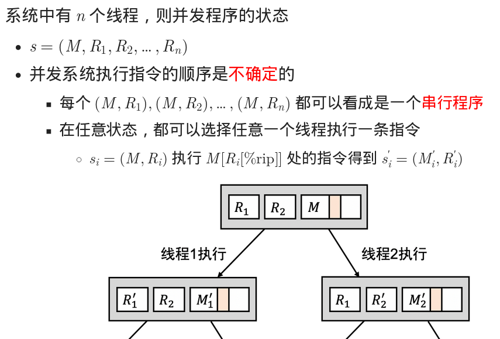
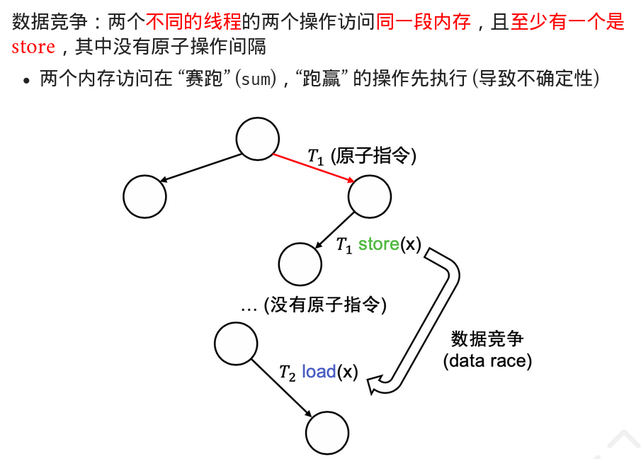
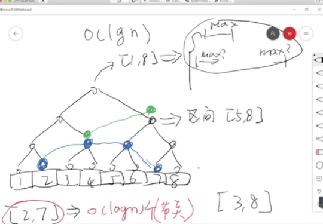

# C1:应用眼中的操作系统

- 什么是程序？：
  
  >+ 可执行文件和其他数据文件: Linux中有多种可执行文件格式，ELF最常用
  >
  >+ 运行的程序称为 **进程**

- ```shell
  file <filename>     #查看文件
  ```

- 常见应用程序

  - Core Utilities(核心工具包)

  - 系统、工具程序
  
    ```shell
  ip address
    ps
  ...
    ```
    
  - ubuntu packages: 可以搜索包
  
- 可执行文件也可以被看作文本文件，其中ELF文件以`0x7f`开头

- 可以用vim,cat,xxd等命令查看可执行文件

  ```shell
  vim /bin/ls    # 乱码,但可以看到字符串常量
  xxd /bin/ls    # 字节码 ，可以看到文件以'\x7f''ELF'开头
  ```
```

## ELF文件

关注信息：

- ELF Header  

  - 文件内容分布、指令集体系结构、入口地址

  ```shell
  readelf -h <elf file>  #-h显示elf的头部
```

- Program Header

  - 决定ELF文件应当被如何加载

  ```
  readelf -l <elf file>
  ```

+ `/usr/include/elf.h` elf的一些定义

## Hello OS World!

- ```shell
  gcc -c hello.c     #生成可重定位文件hello.o
  .c -> (preprocess) -> .i -> (compile) -> .s -> (assembly) -> .o -> (link) -> a.out
  ```

#### 尝试1

- 尝试链接: `ld hello.o`

```shell
(base) ➜  [/home/derek/test] git:(b2) ✗ ld main.o
ld: warning: cannot find entry symbol _start; defaulting to 00000000004000b0
main.o: In function `main':
main.c:(.text+0xc): undefined reference to `puts'
```

- 出现该问题是因为在`-O0`优化下编译器仍会把`printf`优化为`puts`，而此处没有与`libc.a`链接，之后会处理该问题。这里我们把`printf`注释掉。
- _start 是链接器默认的入口，可以手工指定入口：`ld -e main hello.o` 将main作为入口

#### 尝试2

- 这里我们把`printf`注释掉，把include注释掉，只有一个main。重新编译并链接,得到a.out。

```shell
(base) ➜  [/home/derek/test] git:(b2) ✗ ./a.out 
[1]    27462 segmentation fault (core dumped)  ./a.out
```

- 尝试gdb调试，发现是因为无人调用`main`，然而`main`在`ret`时返回地址存在且越界 
- gdb 的 starti 命令可以在程序的第一条指令停下来
- 单步调试后，发现return出错，栈上没有返回地址，返回访问了非法的地址

#### 尝试3

- 不用`main.c`, 编写一段汇编minimal.S
- gcc -c minimal.S  得到  minimal.o , 链接后得到 a.out

#### main之前发生了什么

+ 一个C程序执行的第一条指令在哪里？

  > + ld-linux-x86-64.so加载了libc
  >
  > + 之后libc完成了自己的初始化

- 首先是操作系统动态链接器，加载了libc
- 然后是libc完成了初始化
- 最后是`main`
- 在`main`函数执行前，会先调用`constructors`构造器，`main`结束后会调用`destructors`析构器

## objdump

- 用于展示目标文件的信息
- 参数
  - -d：展示反汇编
  - -S：如果目标文件使用-g选项编译，-S可以同时展示源代码和汇编: objdump -S a.out

## strace

```
strace <program>
```

- 打印程序的系统调用序列

```
strace -f gcc main.c #可获取子进程的系统调用
```

- `strace ./a.out` 

+ `strace ./a.out > /dev/null` ，将标准输出重定向到null
+ `strace -f gcc a.c 2>&1  |  grep execve`,将标准错误输出重定向到标准输出，并用grep查看execve的系统调用情况:
+ collect2系统调用：收集器，合成构造器与析构器

## 图形界面 Demo

- GUI编辑器`xedit`
- 通过`strace`查看`xedit`的系统调用

```
recvmsg(3, {msg_namelen=0}, 0)          = -1 EAGAIN (Resource temporarily unavailable)
poll([{fd=3, events=POLLIN|POLLOUT}], 1, -1) = 1 ([{fd=3, revents=POLLOUT}])
```


# 并发：共享内存多线程(1)

+ **并发 (Concurrency)** 多个执行流可以不按照一个特定的顺序执行
+ **并行 (Parallelism)**：允许多个执行流同时执行 (多个处理器)
+ **线程**：多个执行流并发/并行执行，并且它们**共享内存**
  - 两个执行流共享代码和所有全局变量 (数据、堆区)
- 线程之间指令的执行顺序是不确定 (*non-deterministic*) 的
  
+ ```c
  extern int x;
  int foo() {
    int volatile t = x;
    t += 1;
    x = t;
  }
  // foo的代码可以共享，t和x可以共享，但两个线程的寄存器，堆栈是独享的
  ```

+ 不同线程：

  >+ 共享代码：所有线程的代码都来自当前进程的代码
  >+ 共享数据：全局数据/堆区可以自由引用
  >+ 独立堆栈：每个线程有独立的堆栈

+ atexit()函数
+ `gcc a.c -I.`可以让`#include <threads.h>`也搜索当前目录
+ `__thread char *base` : thread-local 变量，属于每个thread自己独享，但是名字相同可以引用的变量

+ 为每个线程分配8MiB的内存

+ **原子性atomicity**

  >+ C代码
  >  - 编译器优化 → 顺序的丧失
  >+ 二进制文件
  >+ 处理器执行
  >  - 中断/并行 → 原子性的丧失
  >  - 乱序执行 → 可见性的丧失

# 并发：共享内存多线程(2)

+ **程序＝有限状态机**

  >+ 
  >
  >+ 应用１: time travel debugging
  >+ 应用2 : record & replay

+ 在gdb中，用``！``来运行外部命令: `gdb !cat /proc/1`;

+ **并发程序的状态机模型**:

  >+ 
  >
  >+ **Perterson算法**：两人互斥
  >
  >>+ 想上厕所的人:
  >>
  >> + 首先举起有自己名字的旗子 
  >>
  >> + 挂上有对方名字的牌子；后挂的牌子会覆盖先前的 
  >>
  >> + 环顾四周，当对方没有举旗或牌子上是自己名字的时候，进入 WC
  >>
  >> + 出 WC 时放下旗子
  >>
  >>+ ```c
  >>  int turn = T1, x = 0, y = 0;
  >>   void thread1() {
  >>   [1] x = 1; turn = T2;
  >>   [2] while (y && turn == T2) ;
  >>   [3] // critical section
  >>   [4] x = 0;
  >>   }
  >>   void thread2() {
  >>   [1] y = 1; turn = T1;
  >>   [2] while (x && turn == T1) ;
  >>   [3] // critical section
  >>   [4] y = 0;
  >>   }    
  >>   ```
  >>   
  >>  + 这里假设机器每次原子地执行一条代码，内存访问立即可见
+ 分析：

  > + 状态表示：(PC1,PC2,x,y,turn)
  > + 初始状态：(1,1,0,0,T1)
  > + 每一步可以不确定地选择一个线程执行一行代码
  > + 状态空间是有限的：5×5×2×2×2, 但如果算法正确，有些状态应该是不可达的,例如 (3,3,x,y,t)


+ 若处理器能交换不同变量的内存访问，则该算法违背了safety


# 并发：并发控制(1)：互斥

### 互斥mutual exclusion

```c
typedef struct {
  ...
} lock_t;
void lock(lock_t *lk);   // 试图获得锁的独占访问，成功获得后返回
void unlock(lock_t *lk); // 释放锁的独占访问
```

- 在任何线程调度 (线程执行的顺序) 下
  - 若某个线程持有锁 (`lock(lk)` 返回且未释放)
  - 则任何其他线程的 `lock(lk)` 都不能返回 

+ 状态机的视角
  + `lock` 返回会进入 “locked” 状态; `unlock` 会清除该状态
  + 初始状态 $s_0$ 不能到达两个线程都进入 locked 的状态 

+ Perterson算法使用load\store在现代处理器中会由于乱序执行而导致错误
+ 一条 `add` 可以看成 `t = load(x); t++; store(x, t)`

- “状态机每一步选择一个线程执行一条指令” 是错误的假设
- 不经意的编译器/处理器乱序的
- 看起来 “原子” (不可分割) 的一条指令并不原子

### 硬件上实现互斥

+ 将load->if->store合成一个指令

  + 一条不可分割的指令，完成：

    - 一次共享内存的 load
    - 向同一个共享内存地址的 store
    - 以及一些线程 (处理器) 本地的计算

  + 在多处理器上，原子操作保证：
  + 原子性: load/store 不会被打断
    + 顺序：线程 (处理器) 执行的乱序只能不能越过原子操作
    + 多处理器之间的可见性：若原子操作 A发生在 B 之前，则 A 之前的 store 对 B 之后的 load 可见

### 自旋锁

```c
int table = KEY;
void lock() {
  while (1) {
    int got = xchg(&table, NOTE);
    if (got == KEY) break;
  }
}
void unlock() {
  xchg(&table, KEY)
}
```

```c
int locked = 0;
void lock()   {
  while (xchg(&locked, 1)) ;
}

void unlock() {
  xchg(&locked, 0);
}
```

+ LR/SC:

  Load Reserved

  1. 完成 `load(x, v)`
  2. 在处理器上标记内存 x 被 “reserved” (盯上你了)
     - 之后可以自由执行几乎任何线程本地的计算
     - 但一旦其他处理器写入 `x`，或当前处理器发生中断/异常，reserved 的状态就失效

  Store Conditional

  1. 尝试完成 store(x, v)
     - 如果 x 依然处于 “reserved” 状态
       - store 成功，返回 0
     - 否则 store 失败 (包括 store 过程中 reserved 失效)，返回 1

  ```c
  void do_lrsc(){
       while (1) {
  [1]    t = lr(x);
  [2]    t = f1/f2(t); // 不同线程可以执行不同操作
  [3]    if (sc(x, t) == SUCC) {
  [4]      break;
         }
       }
  }
  ```

+ 只要 lr/sc 满足顺序/可见性/原子性，lr 到 sc 之间的区域就是原子的！

- 用原子的 load/store 实现了一段代码的原子性 (精妙)
  - 偶尔会失败，提供 abort 机制

### 数据竞争



如果程序没有数据竞争 (race-free)，那么： 

- 两个来自不同线程对同一段内存的访问 (至少有一个是 store) 之间必定有原子操作
  - load/store, store/load, store/store
- 原子操作保证了
  - 顺序
  - 可见性


# C2:硬件眼中的操作系统

+ 使用工具：

  + ld (链接器), as (汇编器)
  + ar (静态库打包), objcopy (目标文件解析)
  + 其他大家会用到的工具: nm(查看符号), strings(查看字符串常量), size, objdump, readelf, ...

+ Firmware ，把用户数据加载到内存。会加载启动盘第一个扇区到 `0x7c00` 内存位置

+ ```makefile
  make -nB \  #编译但不运行，把编译的命令都打印出来
    | grep -ve '^\(\#\|echo\|mkdir\|make\)' \  #把无关命令去掉
    | sed "s#$AM_HOME#\$AM_HOME#g" \ #把AM_HOME变量替换成字符串AM_HOME
    | sed "s#$PWD#.#g" \  #把当前目录替换成点
    | vim -
  ```

  + `make -nB` (RTFM)
  + grep: 文本过滤，省略了一些干扰项
    - echo (提示信息)
    - mkdir (目录建立)
    - make (sub-goals)
  + sed: 让输出更易读
    - 将绝对路径替换成相对路径
  + vim: 更舒适的编辑/查看体验
  + 在vim里`:%s/ /\r  /g`:把所有空格替换成换行

+ make run smp=4：启动4个处理器

+ ```c
  int main(const char *args); //声明
  static void call_main(const char *args) {
    _halt(main(args));
  }  //main函数的wrapper
  ```


# 并发：并发控制(2)：互斥

### 操作系统是个状态机

+ thread-os-mp.c：多处理器的线程实现：

  + 每个 CPU 有自己的 `struct cpu_local`

    - 包含当前 CPU 上正在运行 task 的指针
+ 每个 task
  
  - 死循环：获得锁 → 打印信息 → 释放锁
  + 程序运行时
    - 每个处理器独立执行、独立响应中断
    - 在中断到来时，保存寄存器现场 (的指针)，切换到下一个 task 执行
      - 每个 task 在编号为 `tid % _ncpu()` 的 CPU 上执行


### 操作系统中的自选锁

+ 存在BUG：一段时间上几乎总是同一个线程获得锁

  + 对于持有锁的处理器，中断大概率出现在 `printf` 中，因为printf的时间很长，若中断出现切换到其他处理器，其他处理器仍在lock死循环中
  + 故：获得自旋锁的线程 (处理器) 不应被中断，否则将会导致大量其他线程 CPU 浪费在自旋上
  + 应该在lock后关闭中断

+ 中断的原子性/顺序

  - 关闭中断后，操作系统上的程序

    - 独占处理器执行
    - 不会被打断

  - `asm volatile` 汇编保证编译器不会调换指令顺序

  - 操作系统上的互斥实现1：关中断+自旋

    ```c
    void spin_lock(spinlock_t &lk) {
      cli();  //关中断
      while (atomic_xchg(&lk->locked, 1)) ;
    }
    
    void spin_unlock(spinlock_t &lk) {
      atomic_xchg(&lk->locked, 0);
      sti();  //开中断
    }
    ```

    bug：

    ```c
    void foo() {
      spin_lock(&lock_a);  //关中断
      spin_lock(&lock_b);  //关中断
      spin_unlock(&lock_b); //开中断
      spin_unlock(&lock_a);  //????
    }
    
    void on_interrupt(_Event *ev, _Context *ctx) {  //在中断处理函数中调用foo
      assert(_intr_read() == 0);
      foo();
      assert(_intr_read() == 0); // 此时中断应该关闭
    }
    ```

  - 正确的实现

    - 在线程第一次 lock 时保存中断状态 FL_IF in %rflags，关闭中断
    
    + 此后线程独占 CPU 执行，将不会被切换
    
  + 在线程最后一次 unlock 时恢复保存的中断状态
    
    + ？？？flags 栈应该保存在何处：锁、线程、cpu?
  - bug2：Reentrance重入
  
    ```c
  // It's not a bug, it's a feature!
    lock(&lk);  //此时lk是1
  lock(&lk);  //此时lk和1交换，仍是1，即另一个处理器持有锁的假象，造成死锁
    printf(...);
  unlock(&lk);
    unlock(&lk);
    ```
  


### xv6自旋锁实现

+ make qemu运行xv6
+ qemu选项：
  + `-nographic` 不启动图形界面 (所以做操作系统实验其实并不需要任何图形界面……)
  + `-S` 使 QEMU 在 CPU Reset 之后暂停不再执行指令

### 互斥锁实现

```c
void mutex_lock(mutexlock_t *lk) {
  int acquired = 0;
  spin_lock(&lk->spinlock);
  if (lk->locked != 0) {
    enqueue(lk->wait_list, current);
    current->status = BLOCKED;
  } else {
    lk->locked = 1;
    acquired = 1;
  }
  spin_unlock(&lk->spinlock);
  if (!acquired) yield(); // 主动切换到其他线程执行
}

void mutex_unlock(mutexlock_t *lk) {
  spin_lock(&lk->spinlock);
  if (!empty(lk->wait_list)) {
    struct task_t *task = dequeue(lk->wait_list);
    task->status = RUNNABLE; // 唤醒之前睡眠的线程
  } else {
    lk->locked = 0;
  }
  spin_unlock(&lk->spinlock);
}
```


# 并发数据结构

+ 链表：

  + ```c
    static inline void list_check(node_t *node) {
      assert(node == node->prev->next); // circular list's offer
      assert(node == node->next->prev);
    }
    //良好的remove实现
    void list_remove(node_t *node) {
      node_t *prev = node->prev;
      node_t *next = node->next;
      assert(prev != next // defensive
          && node != prev
          && node != next); // more checks than necessary
                            // may find bugs in other parts of the system
      prev->next = next;
      next->prev = prev; // possibly prev == next
      list_check(prev); list_check(next);
    }
    ```

  + **嵌入在其他数据结构中的双向循环链表**

    ```c
    struct list_head {
      struct list_head *next, *prev;
    };
    struct task {
      ...
      struct list_head wait_queue;
      ...
    };
    //得到task的首地址
    #define list_entry(ptr, type, member) \
      ((type *) \
        ( (char *)(ptr) - (uintptr_t)(&((type *)0)->member) ) \
      )
    //指向wait_queue的指针减去把０作为type类型转成整数
    // ptr to struct list_head
    struct task *task = list_entry(ptr, struct task, wait_queue);
    ```

    

### malloc/free

shell脚本文件:vi mtrace.sh

```shell
#!/bin/bash

trace() {
  # ltrace outputs to stderr, so discard stdout
  # -f: trace threads/sub-processes
  # -e 'malloc+free-@libc.so*': only trace malloc/free
  ltrace -f -e 'malloc+free-@libc.so*' $@ > /dev/null
}

trace $@ 2>&1 # move stderr to stdout
```

添加权限：`chmod u+x mtrace.sh`,就可以用./mtrace.sh或sh mtrace.sh运行脚本。

```shell
./mtrace.sh gcc sum.c | grep malloc
```

### Fast Path

+ 大内存分配后要使用，不会太频繁，不太可能所有线程都要挤着分配大内存，而小内存是可能的
+ 策略：小内存分配在线程本地分配，使用简单的数据结构
+ **SLAB**:　
  + 设置常用的内存大小如:4B,8B,24B等
  + 在一个４KB页面上存储了一些元数据如是用于24字节的分配，接着存储了多个24B的对象
  + 当内存分配请求到来时，根据其大小决定它应该属于多少个字节的SLAB
  + bitmap 
  + 将同属于一个字节的slab用链表连接起来，


### Slow Path

+ slab分配失败，执行大内存分配:从全局获得一个新的slab， 线段树
+ 

+ 


# 并发：并发控制(3)：同步

### 同步

+ 两个或两个以上随时间变化的量在变化过程中保持一定的相对关系

  + 线程同步 (在某个时间点共同达到一致的状态)

+ + 并发
    + 两个线程各自完成某件事

  + 互斥
    + 上厕所排好队，一个接一个

  + 同步
    + 在未来某个约定的时刻，两个线程的执行点互相可知
    + 通常是先到的线程等待

+ volatile变量使编译器对这个变量的读和写都有一条命令

+ 生产者－消费者问题

  ```c
  void consumer_thread() {
    while (1) {
      object_t *obj = dequeue(); // spin：队列可能没有元素
      if (obj) consume(obj);
    }
  }
  void producer_thread() {
    while (1) {
      object_t *obj = produce();
      while (enqueue(obj) != SUCC); // spin: 队列可能空间不足
    }
  }
  //另一种表达：
  void type1_thread() {
    while (1) printf("("); // enqueue
  }
  void type2_thread() {
    while (1) printf(")"); // dequeue
  }
  ```

### 条件变量

+ 同步的本质：当某个条件满足时，线程执行，否则等待
  + 用一个对象来表示条件的满足/不满足
    - 条件不满足，随时可以在这个对象上等待
    - 另一个线程发现条件满足，唤醒一个 (或所有) 正在等待的线程

+ 对于一个条件变量 cv：
  - wait(cv)
    - 进入睡眠状态，等待 cv 上的事件发生
  - signal/notify(cv) 💬 私信：走起
    - 报告 cv 上的事件发生
    - 如果有线程正在等待 cv，则唤醒其中一个线程
  - broadcast/notifyAll(cv) 📣 所有人：走起
    - 报告 cv 上的事件发生
    - 唤醒全部正在等待 cv 的线程

```c
void producer_thread() {
  while (1) {
    // produce
    mutex_lock(&mutex);
    if (count == n) wait(&cv, &mutex); // 等待“有空闲”,wait会把互斥锁释放并等待，当cv满足时重新上锁
    printf("("); // push
    count++; signal(&cv);
    mutex_unlock(&mutex);
  }
}

void consumer_thread() {
  while (1) {
    mutex_lock(&mutex);
    if (count == 0) wait(&cv, &mutex); // 等待“有数据”
    printf(")"); // pop
    count--; signal(&cv);
    mutex_unlock(&mutex);
    // consume
  }
}
```

+ 有bug!**需要两个条件变量**,

```c
empty:count!=n;fill:count!=0;
P:
 if(count!=n) wait(empty)
 print("(");count++;
 signal(fill)
C:
 if(count==0) wait(fill)
 print("）")；count--;
 signal(empty)
     
//或者把if 改为 while
```

```c
//条件变量：无赖
mutex_lock(&big_lock);
while (!(cond)) {
  wait(&cv, &big_lock);
}
assert(cond); // 一定为真
// 其他需要原子性的操作
mutex_unlock(&big_lock);
```

### 信号变量


+ 哲学家吃饭问题

  

  使用条件变量：

  ```c
  #define cond (empty[lhs] && empty[rhs])
  
  void philosopher(int id) {
    int lhs = (id - 1 + n) % n, rhs = (id + 1) % n;
    mutex_lock(&mutex);
    while (!cond) {
      wait(&cv, &mutex);
    }
    assert(cond);
    empty[lhs] = empty[rhs] = 0;
    mutex_unlock(&mutex);
  
    __philosopher_eat();
  
    mutex_lock(&mutex);
    emtpy[lhs] = empty[rhs] = 1;
    broadcast(&cv); // 对所有人喊：叉子放回去啦，快看看吧！
    mutex_unlock(&mutex);
  }
  ```

  

# C3:并发Bugs

+ 调试公理：
  + **机器永远是对的**
  + **未测试代码永远是错的**
+ Fault(bug)->Eroor(程序状态错)->Failure(可观测的结果错)
  + 只能观察到failure


### 死锁(deadlock)

+ AA-TYPE:

  ```C
  void normal_code() {
    spin_lock(&list_lock);
    spin_lock(&xxx);   //下一行执行后发生中断
    spin_unlock(&xxx); // ---------+
  }                          //    |
  void interrupt_handler() { //    |
    spin_lock(&list_lock);   // <--+
    spin_unlock(&list_lock);
  }
  ```

  容易解决：`if(holding(lk)) panic();`

  

+ ABBA-TYPE:

  ```c
  void move_obj(int i, int j) {
    spin_lock(&lock[i]);
    spin_lock(&lock[j]);
    arr[i] = NULL;
    arr[j] = arr[i];
    spin_unlock(&lock[j]);
    spin_unlock(&lock[i]);
  }
  ```

  - 
    move_obj本身看起来没有问题
    
- 问题是它有一个隐含的 lock ordering 的 requirement
    - `move_obj(1, 2)`; `move_obj(2, 1)` → 死锁: 进程A获得lock1后，B获得lock2，此后A的lock2和B的lock1形成死锁。
- 需要严格按照固定的顺序获得所有锁

+ 死锁产生的四个必要条件 ([Edward G. Coffman](https://en.wikipedia.org/wiki/Edward_G._Coffman,_Jr.), 1971):
  - 互斥：一个资源每次只能被一个进程使用
  - 请求与保持：一个进程请求资阻塞时，不释放已获得的资源
  - 不剥夺：进程已获得的资源不能强行剥夺
  - 循环等待：若干进程之间形成头尾相接的循环等待资源关系

+ 非死锁并发bug:
  + 原子性违反(Atomicity Violation)：忘记上锁
  + 顺序违反(Order Violation) ：忘记同步

### L1 alloc/free测试

+ 以概率生成alloc_size
+ 在cpu本地缓存本cpu的alloc 序列，满了就放入一个全局数据结构，其他cpu可以获得从而free
+ 在适当的时候插入delay()


# 虚拟化:进程抽象

+ fork()：将状态机做一份拷贝（寄存器现场、数据），两个进程互不相干继续向前执行

  ```c
  if(fork()==0){
      //子进程，fork()返回0
  }
  else{
      //父进程，fork()返回父进程的进程号pid
  }
  ```

  ```c
  //fork bomb
  :(){:|:&};:   # 刚才的一行版本
  
  :() {         # 格式化一下
    : | : &
  }; :
  
  fork() {      # bash: 允许冒号作为标识符……
    fork | fork &
  }; fork
  ```

  ```c
  #define n 2
  //此时直接运行./out得到6个hello；但是通过管道重定向到如less后，却打印了8个
  // .out 2 |wc -l  ->8
  // 当有管道时printf会把字符写入到libc的一个缓冲区中，
  int main() {
    for (int i = 0; i < n; i++) {
      fork();
      printf("Hello\n");
    }
  }
  ```


+ execve(filename,argv,env)：

  执行名为filename的程序，传入参数argv和环境变量envp(e)

  ```bash
  export PS1="> "  #命令行开头变成了> 
  ```

+ _exit()_：

  - 销毁当前状态机，并允许有一个返回值
  - 子进程终止会通知父进程 (之后的内容)

+ exit 的几种写法 (它们是不同的)

  - exit(0) - stdlib.h中声明的 libc 函数
    - 会调用 `atexit`
  - _exit(0) \- glibc 的 syscall wrapper
    - 执行 “exit_group” 系统调用终止整个进程 (所有线程)
      - 细心的同学已经在 strace 中发现了
    - 不会调用 `atexit`
  - syscall(SYS_exit, 0)
    - 执行 “`exit`” 系统调用终止当前线程
    - 不会调用 `atexit`


# C4:操作系统中的进程

100行的os代码，xv6进程调试


# 虚拟化:虚存抽象

+ 进程执行指令需要代码、数据、堆栈

+ 指针可以指向地址空间的合法与非法地址，地址空间由段组成，每个段是地址空间中连续的一段内存，有访问权限

+ `pmap`命令：查看进程的地址空间

  + use：`pmap pid`进程号

+ ```c
  /*creates a new mapping in the virtual address space of the calling process
  prot：可以设置权限：可执行、可读、可写、不能访问；
  允许将文件中的内容映射到内存中的地址空间，所以进程的代码和数据由mmap搬入内存*/
  void *mmap(void *addr, size_t length, int prot, int flags,
             int fd, off_t offset);
  /*将内存中的映射移除*/
  int munmap(void *addr, size_t length);
  // 修改映射权限
  int mprotect(void *addr, size_t length, int prot);
  ```

+ ```shell
  gcc a.c  #默认编译成动态链接，
  gcc -static a.c -o static.out #静态链接
  file a.c　#查看
  time gcc a.c , time gcc -static a.c #可以发现后者时间更长
  ./a.out &　#放入后台执行
  ```

+ 分页机制：字典树


# C5:链接与加载

### 静态链接与加载

+ 需求：允许引用其他文件
+ 使用 gcc 的 `-Wl,--verbose` 可以将 `--verbose` 传递给 ld
  - 近距离观察 ld 的行为
    - ldscript 中各个 section 按照何种顺序 “粘贴”
    - ctors/dtors (constructors/destructors) 的实现
      - 我们用过 `__attribute__((constructor))` 
    - 只读数据和读写数据之间的 padding
      - `. = DATA_SEGMENT_ALIGN ...`
+ 根据 ELF program header，将文件中指定的部分移动到内存
+ 操作系统在 execve 时完成
  - 操作系统在内核态调用 mmap
    - (进程还未准备好时，由内核直接执行 “系统调用”)
    - 映射好 a.out 代码、数据、堆区、堆栈、vvar, vdso, vsyscall


### 动态链接与加载

+ 需求：如libc.so
  + 每个程序如果都静态链接，浪费的空间很大
  + 最好是整个系统里只有一个 libc 的副本
    - 文件系统里只有一个副本 (libc.so)
    - 内存里只有一个副本
+ 实现动态加载：
  + 一：加载纯粹的代码，把代码编译成位置无关的，然后直接把代码mmap进进程的地址空间就行了
  + 二：需要加载代码和数据，
  + 三：允许访问其他动态链接库导出的符号（代码/数据）：查表（编译成call *table[foo]）

+ PIC+查表实现动态链接

  + > 考虑实际中的动态链接 (共享代码) 的需求
    >
    > - main 要调用 libc 中的 printf
    > - printf 要调用 libfoo 中的 foo

    libld 由操作系统加载 (甩锅成功)

    1. libld 加载 libfoo, 一切顺利
    2. libld 加载 libc
       - libc 对 foo 的调用被编译成 `call *libc.tab[FOO]`
       - libld 调用 `_dl_runtime_resolve` 解析符号，填入 `libc.tab[FOO]`
    3. libld 完成 main 的初始化
       - a.out 对 printf 的调用被编译成 `call *a.out.tab[PRINTF]`
       - libld 解析 printf 的地址，填入 `a.out.tab[PRINTF]`

+ GOT(global offset table)：shared object 用来存储动态符号的表格

  - 库函数有
  - 可执行文件也有
    - 所以用 file 查看 a.out 和 libc.so 都是 “shared object”
  - GOT 中储存的数据
    - `GOT[0]`: `.dynamic` 节的地址
    - GOT[1] : link map
      - 用于遍历依赖的动态链接库
    - GOT[2] :  _dl_runtime_resolve 的地址
      - `call *GOT[2]` 可以完成符号解析
    - `GOT[i]`: 程序所需的动态符号地址 (printf, ...)

+ 程序可能会引用很多符号，但执行时可能大部分符号都没用到

  + 


# 虚拟化:处理器调度

+ 当任务可以在一天内任意时间到达时，任务的cost=完成时间－到达时间，在任意时刻，若有k个任务在等待，这个时刻就要付出k的cost，所以应该以减少k为最优先考虑
  - 让当前剩余执行时间最小的任务执行！
  - 新到的 short job 会 “抢占” 当前 job 执行
    - Shortest Time-to-Completion First (STCF)

### 单处理器分时调度1

+ 中断机制：进程不再独占处理器知道运行完成，操作系统代码执行调度策略选择一个进程，使用中断返回机制运行上下文

+ 基本假设：

  1. 进程是 while (1) do_sth()　的循环
  
      - 执行计算，使用 CPU
      - 等待 I/O 返回，不使用 CPU (通常时间较长)
   2. 处理器以固定的频率被中断
   3. 随时可能有新的进程被创建或旧的进程退出
  
+ 策略：**Round-Robin 轮转**

  假设当前$T_i$运行

  - 中断后试图切换到下一个线程$T_{(i-1)mod\text{ }n}$. 
  - 如果下一个线程正在等待 I/O 返回，继续尝试下一个 ：123123123...
    - 如果系统所有的线程都不需要 CPU，就调度 idle 进程执行（空/死循环的线程）
    - 执行 `hlt` 指令进入低功耗模式等待中断
  - 

  + **所有的进程看起来都是公平的**

+ 策略：**引入优先级**

  + niceness: 越 nice，越被不 nice 的人抢占

    -20: 极坏; most favorable to the process

    19: 极好; least favorable to the process

+ 策略：**多级反馈调度 (MLFQ)**

  + 

+ **Complete Fair Scheduling (CFS)完全公平调度**

  + 让系统里的所有进程尽可能公平地共享处理器

    - 记录系统中每个进程的精确运行时间 (vruntime, nanoseconds)
    - 中断发生后，切换到 vruntime 最少的进程执行
      - 下次中断后，当前进程的 vruntime 可能就不是最小的了

  +  复杂的情况 (1): 创建新进程/线程
    
     - 子进程继承父进程的 vruntime
     
  + 复杂的情况 (2): I/O
  
    + I/O (例如 1 分钟) 以后回来 vruntime 严重落后
  
    + 为了赶上，CPU 会全部归它所有
    + 解决：唤醒的线程获得 “最小” 的 vruntime (可以立即被执行)
  
  + 实现优先级
  
    + 让好人的时间变得快一些，坏人的时间变得慢一些……
  
    + vrt[i] / vrt[j] 的增加比例 = wt[j] / wt[i]

### 单处理器分时调度2

+ 调度策略的复杂性来源

  > - 因为线程不是 `while (1)` 的循环
  > - 进程/线程不是纯粹的计算或 (长时间) I/O
  >   - 等待互斥锁/信号量
  >   - 或是非常短暂的 I/O 等待 (比一个时间片短很多)